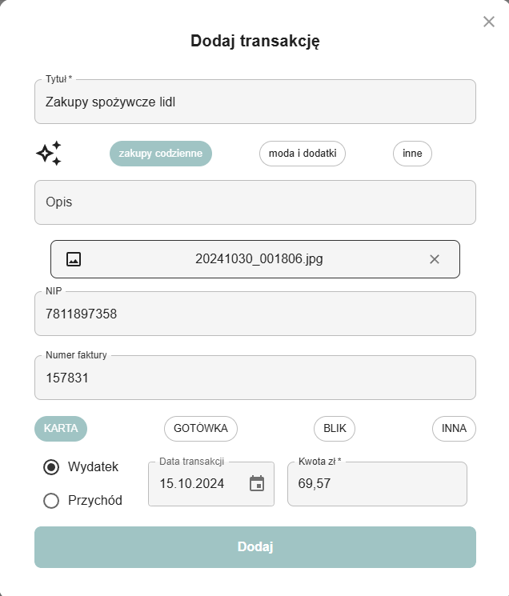
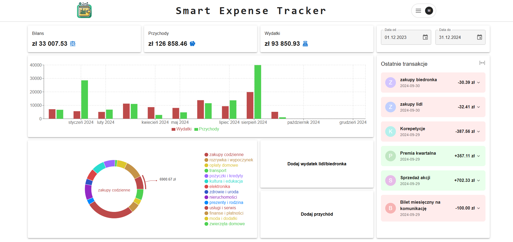
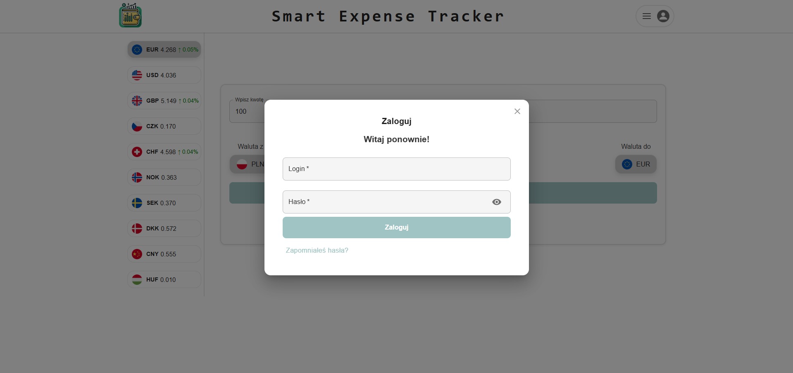

# Smart Expense Tracker - README

## Overview

The Finance Management Application is an advanced web-based tool designed to simplify personal finance management by automatically extracting and classifying data from receipts. Users can track their expenses, analyze financial trends, and access currency exchange rates—all through an intuitive dashboard.

<div style="display: flex; justify-content: space-around; align-items: center;">
    
    
</div>





## Key Features

1. **Automatic Expense Classification:**

    - Extracts information from receipts and invoices using OCR and YOLOv8 object detection.
    - Classifies expenses using a fine-tuned Polish BERT model (herbert-large-cased).

2. **Advanced Image Processing:**

    - Utilizes Gaussian noise reduction, morphological operations, and perspective transformations for document isolation.
    - Employs a CNN to optimize image processing workflows.

3. **Interactive Dashboard:**

    - Displays categorized spending with interactive charts.
    - Provides daily updated currency exchange rates.

4. **Secure User Management:**

    - Supports user registration, email-based activation, secure login and password reset.

## Technology Stack

### Frontend:

- **React**

### Backend:

- **Spring Boot**
- **FastAPI**

### Database:

- **PostgreSQL**

### Machine Learning:

- **YOLOv8 OBB**: Detects receipt details (e.g., date, total, NIP).
- **Tesseract OCR**: Extracts text from receipts.
- **BERT (herbert-large-cased)**: Classifies transactions based on title content.

## How to Run

1. Install dependencies in `frontend/`:

   ```bash
   npm install
   ```

2. Python:
    - Download models and training files:
        - `bert_model/link - 0.9228.zip`
        - `cnn_model/link - 0.9737.keras`
        - `yoloTrainer/link - /models, /yolo_training_runs`
        - `pip install -r requirements.txt` - in main folder
    - Unzip all archives — ensure no duplicated folders.
   - Set the path to Tesseract in the main Python file.
   - Run the FastAPI server:
   ```bash
   uvicorn main:app --reload --host 0.0.0.0 --port 8000
   ```
   

3. Spring Boot configuration:
    - Install dependencies listed in `pom.xml` for `/backendJava`.
    - Set an Outlook email address in `application-properties`.
    - Create a PostgreSQL database named `smartExpenseApp` or `smartexpenseapp` (Linux - change properties).
    - Create a file `application-secrets.properties` with the following fields:
    ```properties
   spring.mail.password=outlook_email_password
   spring.datasource.password=database_password
   ```


## Contact

matimusial5@gmail.com
